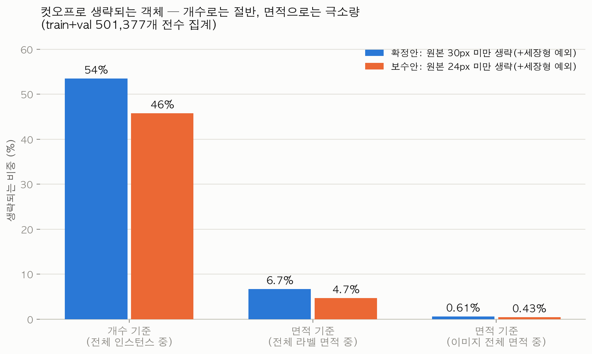

# 철스크랩 라벨링 컷오프 기준 — 정의·정량 분석·소형 객체 처리 방안
> 2026-07-23. 히스토리 서술 없이 **정의와 정량 분석만** 담은 문서.
> 데이터 근거: train+val 501,377 인스턴스 전수 집계(`exp5_instances.csv.gz`), 재학습 8건(`exp2/6/7_results.csv`), stride4 생존 시뮬레이션(`exp5_survival_summary.md`), base 모델 confusion matrix, val 25장 예측 검증(2026-07-23).
> 이미지: `연구요약_20260723_assets/`

---

## 1. 용어와 개념 정의

### 1-1. "그린다 / 안 그려도 된다"의 의미

여기서 "그린다"는 **라벨링 작업자가 어노테이션 도구(LabelMe)에서 객체의 외곽선을 따라 점을 찍어 폴리곤을 만드는 작업**을 뜻한다.

| 표현 | 실제 의미 | 데이터에 남는 것 |
|---|---|---|
| "그린다" | 객체 하나의 윤곽 폴리곤을 생성 | JSON에 해당 객체의 점 좌표 + 클래스명 1건 |
| "안 그린다(생략)" | 그 객체의 폴리곤을 만들지 않음 | 아무것도 없음 — 해당 픽셀은 **배경(라벨 없음)** 취급 |

즉 컷오프 기준("얼마나 작으면 안 그려도 되나")은 **이미지를 지우거나 객체를 지우는 것이 아니라, 라벨링 공정에서 폴리곤 생성 작업을 생략하는 하한선**이다. 생략된 객체는 학습·평가 모두에서 "없는 것"으로 취급된다 (이 취급을 바꾸는 방안이 §3).

### 1-2. 컷오프 "원본 30×30px"의 정의와 크기 감각

컷오프는 bbox가 아니라 **√(폴리곤 면적)** 기준이다. "원본 30×30px 미만" = 폴리곤 면적이 900px²(=30²) 미만.

| 환산 단계 | 값 | 설명 |
|---|---|---|
| 원본 4K (3840×2160) | **√면적 30px** (면적 900px²) | 라벨링 작업자가 보는 기준 |
| 학습 입력 1280 (letterbox, 1/3 축소) | √면적 10px (면적 100px²) | 모델이 받는 크기 |
| 마스크 내부 해상도 proto 320 (입력의 1/4) | **√면적 2.5px** | 모델이 마스크를 실제로 표현하는 해상도 — 2.5×2.5셀 |
| 프레임 가로폭 대비 | 30/3840 = **0.78%** | 화면 가로의 1/128 |

핵심: 1280 입력 모델의 마스크 해상도(stride 4)에서 30px 객체는 **2~3셀짜리 점**이다. 이보다 작으면 정답(GT) 마스크조차 학습 직전 다운샘플 단계에서 뭉개진다 (§2-4).

### 1-3. "면적비 0.011%"는 어떤 면적비인가

**객체 1개의 폴리곤 면적 ÷ 4K 프레임 전체 면적**이다.

```
30×30 = 900px²  ÷  3840×2160 = 8,294,400px²  =  0.0109% ≈ 0.011%
```

| 주의점 | 내용 |
|---|---|
| 분모는 "프레임 전체" | 적재함(화물칸) 면적 대비가 **아니다**. 적재함이 프레임의 약 1/3이라면 적재함 대비로는 ~0.03% 수준 |
| 참고: 전체 라벨의 면적 | 라벨된 모든 폴리곤의 면적 합은 프레임의 약 7~9% (val 25장 union 실측 6.9%, 전수 합산 9.0%) — 나머지 91~93%는 원래 라벨이 없는 영역(도로·차체·미식별 잔재물) |

### 1-4. "세장형"의 정의

세장형(細長形) = **가늘고 긴 형태의 객체**. 철근(rebar), 작은 파이프(small pipe), 각파이프(square pipe), 파이프(pipe), 철망(mesh)이 대표다.

이들이 문제가 되는 이유: 길이는 길어도 폭이 가늘어서 **면적이 작다**. 면적 기준 컷오프만 적용하면 "화면을 가로지르는 3m짜리 철근"이 면적 미달로 통째로 생략된다.

| 규칙 요소 | 정의 (원본 4K 기준) |
|---|---|
| 세장형 예외 | √면적 30px 미만이어도 **bbox 긴 변 ≥ 72px면 라벨 유지** |
| 두께 | 폴리곤 면적 ÷ 긴 변 (평균 폭) |
| 두께 하한 (권고) | 두께 **6px 미만**은 stride4에서 GT의 52~75%가 조각남 → 라벨은 유지하되 **작업 우선순위 최하위** |

이 예외의 성능 근거: 예외를 없애면 전체 mAP는 +0.35%p 오르지만 **rebar AP50이 0.1055 → 0.0634로 40% 급락**한다 (exp6 ablation).

---

## 2. "생략되는 객체가 너무 많은 게 아닌가" — 개수와 면적의 분리

### 2-1. 결론 수치: 개수로는 절반, 면적으로는 극소량

확정안(30px 미만 생략 + 세장형 예외)을 501,377개 전수에 적용하면:

| 기준 | 생략되는 비중 |
|---|---|
| **개수** (전체 인스턴스 중) | **53.5%** (268,155개) |
| **면적** (전체 라벨 면적 중) | **6.69%** |
| **면적** (이미지 전체 면적 중) | **0.605%** |



"너무 많다"는 인상은 개수 기준에서만 성립한다. 생략 대상은 하나하나가 프레임의 0.011% 미만인 초소형이라, **절반의 개수를 생략해도 면적(=물량 정보)의 93.3%는 라벨에 남는다.** 철스크랩 물동량 판정이 면적·중량 상관에 기반한다는 점에서, 면적 보존율이 실질 지표다.

### 2-2. 클래스별 생략 비율 (확정안 기준, 개수)

| 클래스 | 생략 비율 | 비고 |
|---|---|---|
| trash | 89.0% | 잡동사니 — 원래 초소형 위주 |
| small pipe | 76.4% | 세장형 예외로 일부 구제됨 (예외 없으면 87.4%) |
| rebar | 69.8% | 〃 (예외 없으면 85.5%) |
| square pipe | 55.1% | |
| structure steel | 49.5% | |
| mixed steel / vehicle / plastic | 37~41% | |
| handler·drum·Guillotine 등 대형 | 낮음 | 대형 클래스는 거의 영향 없음 |

### 2-3. 학습 성능에 미치는 영향 (재학습 8건, 공통 val 재평가)

| 조건 | 공통 val mask mAP50 | 무필터 대비 | 라벨 공수 |
|---|---|---|---|
| 무필터 (전부 라벨) | 0.4872 | — | 100% |
| 24px 미만 생략 | 0.4857 | **−0.15%p** | 54.2% |
| **30px 미만 생략 (확정)** | 0.4766 | **−1.06%p** | 46.5% |
| 36px 미만 생략 | 0.4510 | −3.62%p | 42% |
| 48px 미만 생략 | 0.4301 | −5.71%p | 38% |


30px 미만 라벨 전체(개수의 절반)가 기여하는 성능은 **1.06%p**다. 24px까지만 낮추면 기여분이 0.15%p로, 무필터와 사실상 동등해진다 — 즉 **모델이 실제로 배우는 신호는 24px 이상에 사실상 전부 들어 있다.**

### 2-4. 왜 그런가: 모델 해상도의 물리적 한계

50만 개 전수 stride4 시뮬레이션(GT를 학습 시 실제 사용되는 1/4 해상도로 줄였다 복원):

| 크기 (√면적, 원본) | 복원 IoU≥0.5 비율 | 해석 |
|---|---|---|
| ~12px | 6~21% | GT부터 형체 소실 |
| 12~18px | 48% | 과반 뭉개짐 |
| 18~30px | 79~93% | 경계 구간 |
| **30px 이상** | **97%+** | 안전 |


30px 미만 구간은 **정답 라벨조차 학습 전에 절반 이상 훼손**되는 구간이다. 라벨링 공수를 들여도 모델에 온전히 전달되지 않는다.

### 2-5. 추론 실증: 그 크기는 실제로도 못 잡는다

base(무필터 학습) 모델을 무필터 val로 평가한 confusion matrix 기준, **rebar 77%·small pipe 72%·trash 82%가 미검출(background 처리)**, 전체 mask recall ~0.49. 생략 논의 대상인 소형·세장형은 라벨이 있어도 현 해상도의 모델이 대부분 잡지 못한다.


---

## 3. 생략되는 소형 객체의 표기 방안 — 4가지 옵션 비교

"생략 대상도 실제 금속 스크랩이므로 어떤 형태로든 표기되어야 하지 않나"에 대한 선택지 분석.

### 3-1. 옵션 요약표

| | A. 완전 생략 | **B. 보수적 개별 라벨 + 코드 필터** | C. 묶음(chunk) 라벨 | D. 영역(stuff) 라벨 |
|---|---|---|---|---|
| 방법 | 컷오프 미만은 아예 안 그림 | 컷오프보다 낮은 하한까지 개별로 그리되, **학습 데이터 생성 시 코드로 필터** | 소형 다수를 큰 폴리곤 1개로 묶어 라벨 | "미세 혼합 스크랩 영역" 같은 영역 클래스를 신설해 면(面)으로 칠함 |
| 라벨 공수 | 최소 (46.5%) | 중간 (하한 24px 시 **54.2%**) | 중간 | 중간 (영역 1개는 그리기 쉬움) |
| **가역성** | **없음 — 안 그린 정보는 소급 불가** | **있음 — 원본 라벨 보존, 필터는 재조정 가능** | 부분적 (개별 정보는 소실) | 부분적 (개수 정보는 소실) |
| 개수(Count) 정보 | 소실 → 지표 분모 합의 필요 | 보존 (원본 기준 재계산 가능) | 소실 (묶음=1개) | 소실 |
| 면적(Area) 정보 | 93.3% 보존 | 100% 보존 | 근사 보존 (묶음 폴리곤이 배경 포함) | **보존 — 면적 지표에 유리** |
| 파이프라인 호환 | 현행 그대로 | **현행 그대로** — 필터 코드 기구현·검증 완료 | 현행 그대로 (클래스 정의만 합의) | **변경 필요** — instance→panoptic 전환 또는 stuff 클래스 추가 |
| 주요 리스크 | 향후 고해상 모델 전환 시 재라벨링 | 공수 증가(+7.7%p), 소형 라벨 품질 관리 | **과거 실패 사례** — "rebar 덩어리 라벨" 품질 이슈 재발, 개별/묶음 혼용 시 모순 신호 | 클래스 체계·계약 변경, 평가 지표 재정의 |

### 3-2. 각 옵션의 분석

**A (완전 생략)** — 현재 확정안. 공수 최소·성능 손실 −1.06%p로 검증됨. 약점은 **비가역성**: 라벨링은 한 번 계약·수행하면 되돌릴 수 없으므로, 나중에 입력 해상도를 1600/1920으로 올리거나(exp3에서 검증 예정) 타일 추론을 도입해 소형 검출력이 회복되면, 안 그린 24~30px 구간을 소급할 방법이 없다.

**B (보수적 개별 라벨 + 코드 필터)** — 라벨 하한과 학습 필터를 분리하는 방안.
- 필터 코드는 이미 존재하고 검증됐다: `prepare_yolo_dataset.py`가 라벨 원본을 건드리지 않고 학습셋 생성 시 크기·예외 조건을 적용하며, 시뮬레이션 정책표와 ±0.1% 일치를 확인했다.
- 하한을 어디에 두느냐가 관건이다. 정량 근거로는 **24px가 합리적 하한**이다:

| 라벨 하한 | 공수 (무필터=100%) | 확정안 대비 추가 공수 | 근거 |
|---|---|---|---|
| 30px (확정안 = A) | 46.5% | — | 학습 최적 컷 |
| **24px (보수 하한)** | **54.2%** | **+7.7%p (+38,543개)** | 24px 이상에 학습 신호 사실상 전부 포함 (−0.15%p) |
| 무제한 (전부) | 100% | +53.5%p (+268,155개) | 12px 미만은 GT 자체가 소실 — 그려도 물리적으로 무의미 |

- 즉 "전부 그리는 보수"는 비효율(추가 27만 개의 대부분이 stride4에서 소실되는 크기)이지만, **"한 단계 낮춰 24px까지 그리는 보수"는 +7.7%p 공수로 모델이 쓸 수 있는 신호 전체와 가역성을 확보**한다. 향후 해상도 상향 시 24~30px 구간을 코드 필터 해제만으로 즉시 활용할 수 있다.

**C (묶음 라벨)** — 공수는 줄지만 과거 데이터에서 실증된 실패 모드가 있다: rebar류를 덩어리로 라벨한 사례가 다수 발견되어 정제 대상이 됐고, 개별·묶음이 한 이미지에 혼재하면 모델에 모순 신호를 준다. 채택한다면 "개별 식별+크기 통과 객체만 개별, 뒤엉킨 다발은 묶음 1개"처럼 **이미지 내 일관성 규칙**이 계약 수준으로 명문화되어야 한다.

**D (영역/stuff 라벨)** — panoptic segmentation의 관점과 정합적이다. 셀 수 없는 미세 혼합 스크랩을 "영역"으로 칠하면 면적 정보가 온전히 보존되고, Area Ratio 지표와도 궁합이 맞는다. 단 (i) 현행 YOLO instance 파이프라인에 stuff 처리를 추가해야 하고 (ii) 클래스 체계 변경은 발주-수행사 간 합의 사항이며 (iii) Count 지표에서 해당 영역은 제외된다는 정의가 필요하다. **중기 과제로 검토할 가치**가 있다 (특히 PQ 평가 체계는 이미 stuff 개념을 갖고 있음).

### 3-3. 조합 가능성

옵션은 상호 배타가 아니다. 예: **B(24px 보수 라벨) + 학습 필터 30px + D(24px 미만 극소형만 영역 클래스 1개로)** 같은 조합은 개수·면적·가역성을 모두 보존한다. 단 조합할수록 라벨링 가이드가 복잡해져 작업 일관성 리스크가 커지므로, 규칙 수는 최소로 유지하는 것이 품질 관리상 유리하다.

---

## 4. "보수적 라벨링 + 코드 필터" 체계의 정량 검토

라벨링의 비가역성을 전제로 한 체계 설계:

| 계층 | 기준 | 성격 |
|---|---|---|
| **라벨링 하한** (사람, 비가역) | 원본 **24px** + 세장형 예외(긴변 72px) | 보수적 — 모델이 쓸 수 있는 신호 전체를 보존 |
| **학습 필터** (코드, 가역) | 원본 **30px** + 세장형 예외 | 최적 — 언제든 재조정 가능 (기구현·검증 완료) |
| 두께 6px 미만 세장형 | 라벨 유지하되 작업 우선순위 최하위 | GT 훼손 구간의 공수 절약 |
| 지표 분모 | "30px 이상"으로 문서 합의 | Count/Area Acc 정의 명확화 |

이 체계의 비용-편익:

| 항목 | 값 |
|---|---|
| 추가 공수 (확정안 대비) | +7.7%p (인스턴스 +38,543개, 24~30px 구간) |
| 확보되는 것 ① | **가역성** — 해상도 상향(exp3)·타일 추론 도입 시 코드 필터 해제만으로 24~30px 라벨 즉시 활용 |
| 확보되는 것 ② | **지표 유연성** — Count/Area를 원본 라벨 기준으로도, 필터 기준으로도 재계산 가능 |
| 확보되는 것 ③ | 컷 경계(30px 부근) 객체의 증강 안전 마진 — 학습 중 축소 증강(scale 0.5×) 시 경계 객체가 실효 컷 아래로 내려가는 문제 완화 |
| 잔여 리스크 | 24px 부근 소형 라벨의 품질(경계 정확도) 관리 — QC 자동화 도구로 검수 필요 |

주의: 24px 미만까지 전부 그리는 "완전 보수"는 권장 근거가 없다. 12px 미만은 GT 자체가 stride4에서 소실되고(생존율 55~92%, IoU≥0.5 6~21%), 해상도를 1920으로 올려도 원본 대비 1/2 축소이므로 극소형의 회복 여지가 제한적이다. 보수의 실익은 24~30px 구간에 집중되어 있다.

---

## 5. 근거 데이터 요약

### 5-1. 재학습 8건 (YOLO26x-seg@1280, 100ep, 공통 val 재평가)

| 조건 | 자기 val mAP50 | 공통 val mAP50 | rebar AP50 | small pipe AP50 |
|---|---|---|---|---|
| base (무필터) | 0.4872 | 0.4872 | — | — |
| cut8 (24px) | 0.6454 | 0.4857 | — | — |
| cut10 (30px+예외) | 0.7043 | 0.4766 | 0.1055 | 0.0846 |
| cut12 (36px) | 0.7259 | 0.4510 | — | — |
| cut16 (48px) | 0.7440 | 0.4301 | — | — |
| cut10_noexc (예외 제거) | 0.7457 | 0.4801 | 0.0634 | 0.0623 |
| cut10_w2 (+두께 6px 조건) | 0.7179 | 0.4777 | 0.0815 | 0.0812 |
| cut10_mr2 (mask_ratio=2) | 0.6886 | 0.4644 | 0.0866 | 0.0733 |


- 자기 val(필터 적용 val)은 필터를 높일수록 상승 — **평가셋이 쉬워진 착시**. 공정 비교는 공통 val 열.
- mask_ratio=1(다운샘플 제거)은 메모리상 실행 불가(A100 80GB OOM), =2는 개선 없음(−1.2%p).


### 5-2. 시각 근거

| 자료 | 내용 |
|---|---|
|  | 두께 ~6px 철근: stride4 복원 시 소실·분절 |
|  | 두께 ~9px small pipe: 계단형이지만 생존 |

정성 비교(GT vs 4개 학습 조건 예측): `연구요약_20260723_assets/qual_zoom_rebar_295_13-24-56.png`, `qual_zoom_smallpipe_429_11-06-37.png`

---

## 6. 한계와 전제

1. 면적 점유율(6.69%/0.605%)은 폴리곤 면적 합산 기준 — 겹침 중복이 포함될 수 있어 union 기준으로는 소폭 낮아질 수 있다.
2. 성능 수치는 YOLO26x-seg@1280·100ep·단일 런 기준 — 정책 간 0.3~0.4%p 차이는 런 분산 범위일 수 있다.
3. 24px 보수 하한의 실익(가역성)은 **해상도 상향 시 소형 검출이 실제로 회복된다**는 가정에 걸려 있다 — exp3(imgsz 1600/1920)가 이 가정을 검증한다. exp3 결과에 따라 보수 하한의 가치가 오르내린다.
4. confusion matrix 기반 미검출률은 정규화 PNG 판독값이다.
5. 옵션 C·D의 공수·품질 영향은 정량 실험이 없는 정성 비교다 — 채택 검토 시 파일럿 라벨링으로 확인 필요.
