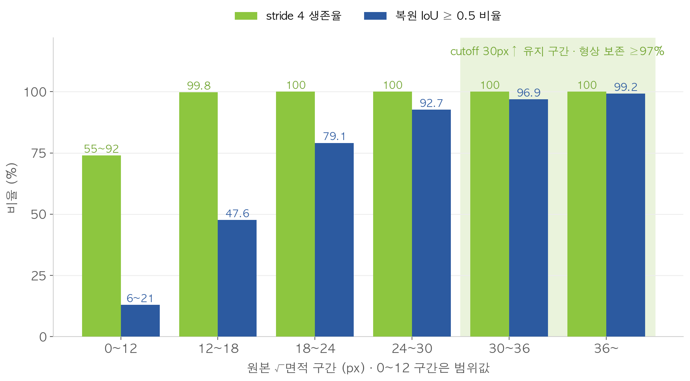
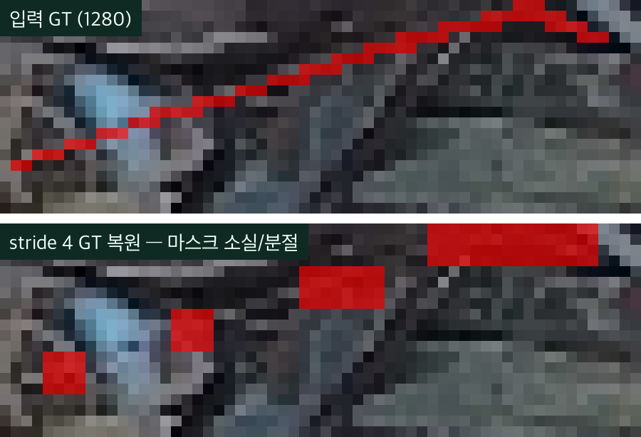
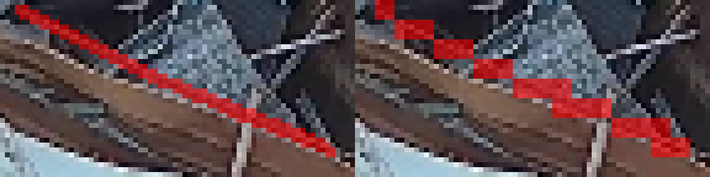
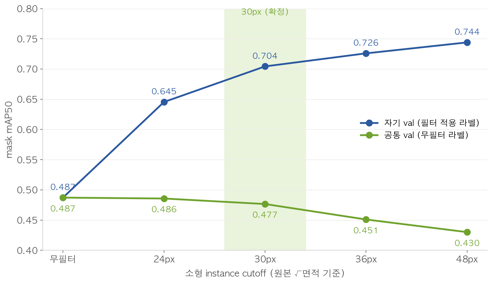
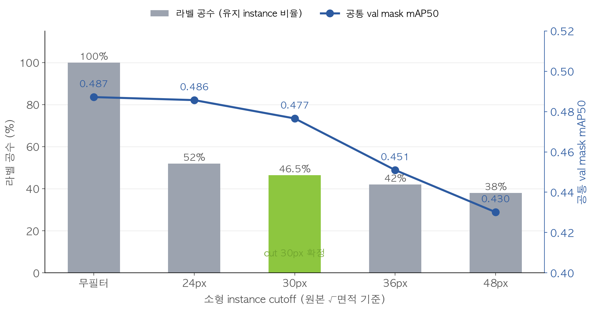
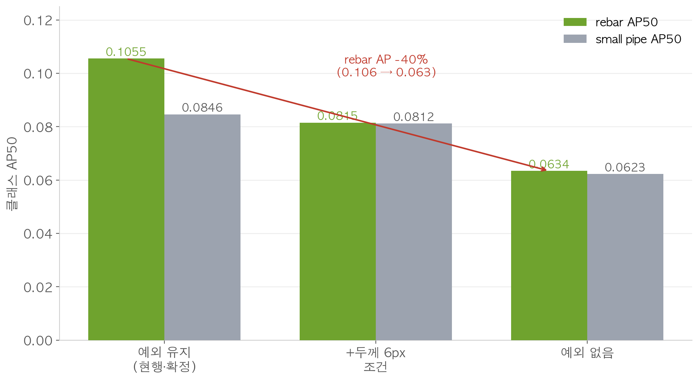
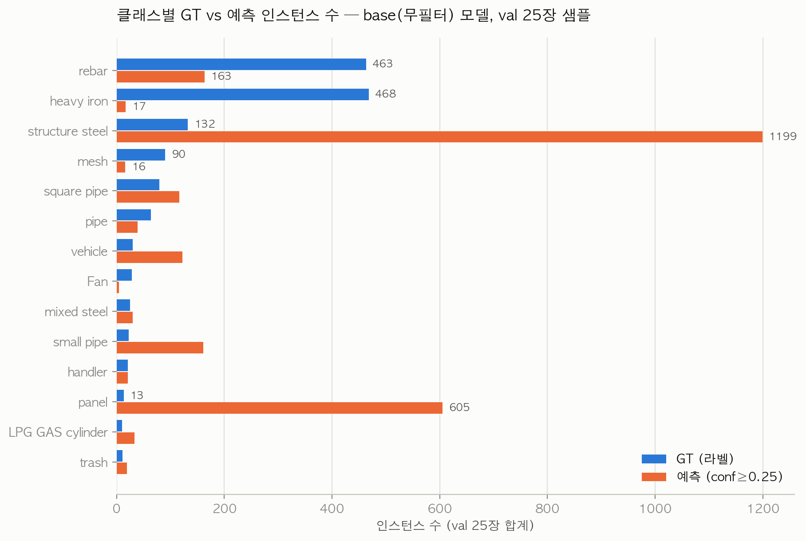
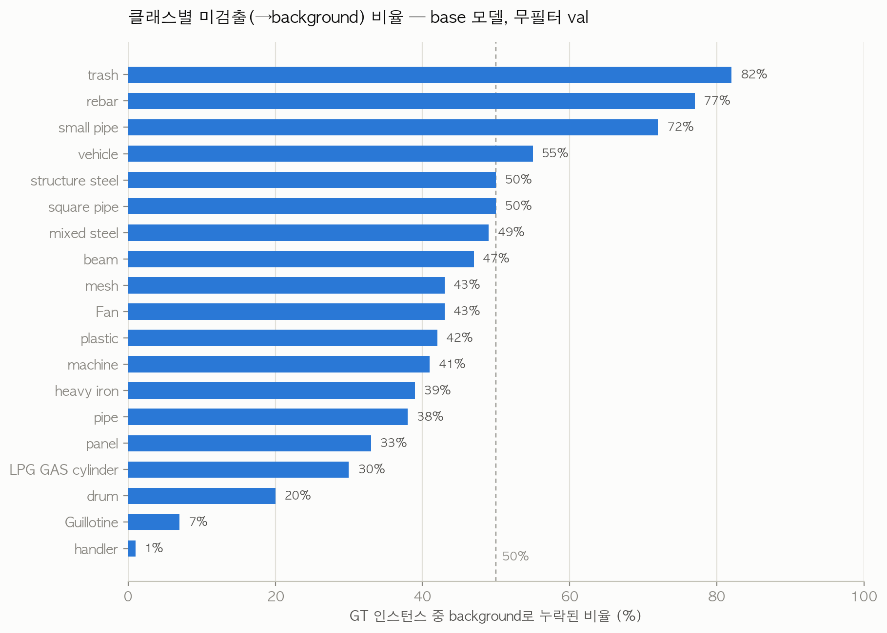

# 철스크랩 세그멘테이션 연구 — 전체 타임라인 & 스토리
> 작성 2026-07-23 (Claude 세션 종합). 근거: 저장소 전수 탐색(2025_인수인계·2026·references·Project·메일회신2/3), EKP 메일 아카이브 46통(`메일아카이브_EKP_20260715.md`), 실험 원자료(exp2/5/6/7 CSV·요약), 그리고 **이 문서를 위해 2026-07-23에 새로 수행한 검증 실험**(val 25장 GT vs 예측 개수·면적 비교, §9).
>
> 이미지: `연구요약_20260723_assets/` (PPT 덱 차트 복사본 + 신규 검증 차트 2종). 표의 수치는 CSV/문서 원값.

---

## 0. 한 장 요약 (TL;DR)

철스크랩을 실은 트럭 적재함을 4K 카메라로 내려다보고, **"어떤 종류의 고철이 얼마나 실려 있나"를 AI가 자동 판정**하게 만드는 과제다 (KEIT 탄소발자국 과제의 1세부, 주관 아이티브에이아이·공동 KIMS).

스토리는 크게 5막이다:

| 막 | 기간 | 줄거리 | 핵심 결과 |
|---|---|---|---|
| 1막 | 2024.07~2025.12 | 카메라 설치 → 데이터 구축 → MaskDINO panoptic 모델 → **논문 게재** | PQ 46.5, 분류정확도 72%, 논문 1건 (2차년도 목표 달성) |
| 2막 | 2026.02~04 | 장준희→이치헌 **인수인계**. "학습이 잘 안 된다"는 문제 상속. 크롭·클래스병합·소객체제거로 돌파구 | mAP50 0.01 → 학습 가능 수준으로 |
| 3막 | 2026.05 | 협력사(itivai)가 신규 라벨링(6/17~10월) 착수 전 **"라벨링 기준을 정해달라"** 공식 의뢰 (1~4순위) | 연구 요청서 확정 (5/28) |
| 4막 | 2026.06 | 1024 기준 필터 스윕 → "필터 높일수록 mAP↑(0.787→0.901)" 공유 → itivai가 **1280 기준 재검증** 요청 | 나중에 이 결론이 **착시**로 판명 |
| 5막 | 2026.07 | 50만 인스턴스 전수분석 → stride4 시뮬레이션 → **재학습 8건** → 컷오프 확정 | **"원본 30×30px 미만 생략 + 세장형 예외 유지"** (7/24 발송 예정) |

그리고 **§9**에서 사용자가 제기한 질문 — "최종 결과에서 예측 인스턴스가 GT보다 너무 적어 보인다" — 을 신규 검증 실험으로 정면 분석한다. 한 줄 결론: **관찰은 사실이지만 원인은 '공백으로 본 것'이 아니라 '가늘고 작은 클래스의 선택적 미검출 + 분류 혼동 + 시각화 조건'의 합성**이다.

---

## 1. 이 과제는 무엇인가

### 1-1. 과제 구조

| 항목 | 내용 |
|---|---|
| 사업 | 산업통상자원부 소재부품기술개발사업 (이종기술융합형), 전문기관 KEIT(산기평) |
| 총괄과제 | "선재 및 철근 제조공정 디지털-그린 연계 탄소발자국 추적 기술개발" — **RS-2024-00448825** |
| 소속 세부 | **1세부** "데이터 기반 철자원 분류 및 품질 판정 기술개발" — RS-2024-00448829 (논문 사사 번호) |
| 주관기관 | ㈜아이티브에이아이 (ITIV AI) — 연구책임 김민엽 이사, 실무 이지홍 과장, 기술창구 심지훈 선임 |
| 공동기관 | ㈜솔위드, ㈜아이트리온, **한국재료연구원(KIMS)**, ㈜보고넷, ㈜포스코, ㈜심팩(SIMPAC) |
| 전체 기간 | **2024.07.01 ~ 2027.12.31** (1단계 3년 6개월) |
| 총 연구개발비 | 5,922,622천원 (정부지원 4,550,000천원) |
| KIMS 역할 | **철스크랩 분류 AI (panoptic segmentation) 개발** |
| KIMS 책임자 | 이호원 → **정재면** (2026-06-30 변경 완료) / 실무 장준희 → **이치헌** (2026-03-17 인수) |

### 1-2. 연차별 목표

| 연차 | 기간 | 목표 | 달성 여부 |
|---|---|---|---|
| 1차년도 | 2024.07~12 | 분류·모니터링 시스템 기술 설계 | 완료 |
| 2차년도 | 2025 | 현장 적용·기능 개발 (분류 AI 모델, 물동량 DB) — **분류정확도 72% + 논문 1건** | **달성** (MaskDINO PQ 46.5 + 논문 게재) |
| 3차년도 | 2026 | **고도화·표준화** — 분류 AI 정확도 80% 목표 + 녹·이물질 분류 모델 연구 | **진행 중** (라벨링 기준 연구가 현안) |
| 4차년도 | 2027 | 실증 | — |

### 1-3. 데이터 한눈에

| 항목 | 내용 |
|---|---|
| 원천 | SIMPAC 야적장 카메라 2대 — 카메라1 Side-view(차량 접근 감지), 카메라2 **Top-view(조업/적재함 촬영)** |
| 본 데이터셋 | `ScrapDataset_2025` (2025-12-09 수령) — 4K(3840×2160) **2,096장 + val 419장**, 89개 원시 클래스, 약 50만 인스턴스 |
| 라벨 형식 | LabelMe JSON 폴리곤 → (전처리) 89 → **19 병합 클래스** → COCO → YOLO seg |
| 19 클래스 | handler, rebar, structure steel, mixed steel, heavy iron, panel, square pipe, mesh, small pipe, trash, vehicle, pipe, plastic, machine, LPG GAS cylinder, beam, drum, Fan, Guillotine |
| 특징 | 이미지당 평균 **~65개 인스턴스** (원시 기준 ~200개), **과반이 아주 작음** — √면적 원본 30px 미만이 59.2% |

---

## 2. 1막 — 태동과 논문 (2024.07 ~ 2025.12)

### 2-1. 무슨 일이 있었나

- **2024-07-01** 과제 착수. 1차년도(6개월)는 시스템 설계.
- **2025년** 데이터 수집 본격화: 조업 비디오(1/14), 필터링 데이터(7/21), 샘플 이미지(9/8), 그리고 **본 라벨 데이터셋 ScrapDataset_2025 (12/9)**.
- 모델은 SOTA 비교(Panoptic-DeepLab, Mask2Former, MaskDINO, YOLOv8+SAM) 끝에 **MaskDINO** 선정. 어노테이션은 15장 기반 55종 semantic + 1,000개 instance로 시작.
- **2025-10** 진도점검회: MaskDINO **PQ 46.5** (things 46.4 / stuff 47.0) vs YOLO+SAM PQ 24.7.
- **2025-11~12** 논문 투고(11/16)→게재확정(11/27), **2차년도 성과보고회(12/10)**: 분류정확도 72% 달성 선언.

### 2-2. 논문 — 지금도 쓰이는 "목표 지표"의 출처

> **"파놉틱 분할 기반 철 스크랩 분류" (Steel Scrap Segmentation via Panoptic Segmentation Approach)**
> 소성·가공학회지 Vol.34 No.6 (2025) pp.342–348. 나주원·장준희·김민엽·이지홍·심지훈·윤준석·김세종(교신).

| 항목 | 내용 |
|---|---|
| 방법 | **MaskDINO** (Transformer encoder-decoder + ResNet-50) panoptic segmentation — ⚠️ 현재 파이프라인(YOLO)과 다름 |
| 데이터 | 4K top-view, 10종 철스크랩, 약 1,000개 인스턴스 (지금의 50만 개 데이터셋과 다른 소규모) |
| 학습 | A6000, batch 4, AdamW lr 1e-4, 50ep (~12h), 추론 0.7초/장 |
| **Count Acc 80.2%** | 클래스별 "개수 맞히기" 평균 — 예: Panels 실제 117 vs 예측 126 (92.3%) |
| **Area Ratio Acc 86.9%** | 클래스별 "면적 비율 맞히기" 평균 |
| **PQ 0.55** | 클래스별 Panoptic Quality 평균 — 최고 House pipe 0.82 / 최저 Panels 0.27 |

이 세 숫자(80.2 / 86.9 / 0.55)가 이후 **YOLO 재구현이 넘어야 할 베이스라인**으로 계속 인용된다. 단, 논문은 10클래스·1,000인스턴스 조건의 수치라서 지금의 19클래스·50만 인스턴스 조건과 직접 비교는 곤란하다는 점이 중요하다.

---

## 3. 2막 — 인수인계와 재출발 (2026.02 ~ 2026.04)

### 3-1. 인수인계 시점의 상태 = "학습이 안 된다"

- **2026-03-17** 장준희 → 이치헌, 자료 6종 인수인계 (2차년도 성과보고 zip, 연차보고서, 진도점검 자료, 중간진도점검, **260211 라벨링 방안 연구요청자료**, 성과보고회 V2).
- **2026-03-18** 장준희의 솔직한 현황 보고: *"전달 데이터 2,096개 중 200개만 선정해 학습했다. 클래스 불균형과 미세객체 때문에 학습이 잘 안 되는 상황."*
- 원본 4K를 그대로 넣으면 **mAP50 0.01** — 사실상 학습 불가. 적재함이 화면의 1/3에 불과하고 객체가 너무 작았다.

### 3-2. 돌파구 3단계 (킥오프 자료에 정리된 계보)

| 단계 | 조치 | 효과 |
|---|---|---|
| ① | **Cargo Area 기준 크롭** — 적재함만 잘라내 해상도 활용 | 학습 가능 수준으로 |
| ② | **89 → 19 클래스 병합** (형상 기준) | bbox mAP **5.8배↑** |
| ③ | **1024 리사이즈 후 짧은변 12px(또는 8px) 미만 소객체 제거** | **8.7배↑** (train 407,527→213,708개로 정리) |

이 "③ 소객체를 어디까지 지울 것인가"가 훗날 라벨링 기준 연구(5막)의 핵심 쟁점이 된다.

### 3-3. 라벨 품질의 발견 (2026-04-03, 장준희 cropped2 정제)

크롭 후 라벨 전수조사에서 발견된 문제들 — **신규 라벨링 가이드(4순위)에 그대로 반영될 교훈**:

| 문제 | 내용 |
|---|---|
| 오라벨 | **"Deck reinforcement steel" 실물이 없는데 1,000장+ 라벨됨** → 제거 |
| 과대 라벨 | handler가 크레인 몸체까지 라벨된 사례 다수 → 제거 |
| **덩어리 라벨** | **rebar류 소형 객체를 뭉텅이로 한 번에 라벨링**한 사례 다수 → 2차 점검 필요 |
| 데이터셋 계보 | 원본(89클래스 풀프레임) → ver1(크롭만) → **ver2 cropped2(크롭+오류 정제, 2,094장)** |

### 3-4. 같은 기간의 행정 (2026 상반기)

| 날짜 | 사건 |
|---|---|
| 02-25 | 2차년도 성과보고 (연차 정산) |
| **04-09** | 산기평 진도점검 결과 **전 기관 연구비 일괄 10% 삭감** — KIMS 150,000→**135,000천원**, 수정계획서 제출 |
| 04-27~28 | **3차년도 킥오프, 제주 오리엔탈 호텔** (1~3세부 발표 + 기관별 협의) |
| 05-06~08 | 3차년도 연구비 RCMS 입금 |
| 05-08~**06-30** | **KIMS 연구책임자 변경 (이호원→정재면)** IRIS 협약변경 — 6/30 완료, 계획서 zip 수령 |

---

## 4. 3막 — "라벨링 기준을 정해달라" (2026.05)

itivai가 **2026-06-17~10월 신규 라벨링**을 앞두고, 라벨링 업체에 줄 **정량 기준**을 KIMS에 공식 의뢰했다 (최초 요청 2/11, 요청서 확정 5/19→5/28).

### 4-1. 우선순위 4개 항목 (5/28 확정)

| 순위 | 항목 | 쉽게 말하면 | 담당 | 목표일 | 현재 상태 |
|---|---|---|---|---|---|
| 1순위 | Polygon **Point 수** 기준 | "점을 몇 개나 찍어야 하나" | itivai | 6/12 | itivai 자체 결론: 복잡도별 **최대 50~100pt**. 최종 가이드 문서 수신 대기 |
| **2순위** | 무의미한 인스턴스 **최대 크기** | **"얼마나 작으면 안 그려도 되나"** | 재료연 | 6/26 → **7/24 재검증** | **확정: 원본 30×30px 미만 생략 + 세장형 예외** (§6) |
| 3순위 | 이미지 크기 × Point 수 균형 | "입력 해상도는 얼마가 최적인가" | 재료연 | 8/4 (7/31 스크리닝) | 코드 준비 완료 (exp3), 실행 대기 |
| 4순위 | 유의미한 인스턴스 **최소 크기** (클래스별) | "클래스마다 어디까지 잡을 수 있나" | 재료연 | 9/4 (8/21 중간) | 코드 준비 완료 (exp4), 실행 대기 |

### 4-2. 왜 이게 중요한가

라벨링 비용은 인스턴스 수에 비례한다. 데이터의 **59%가 원본 30px 미만의 초소형**인데, 이것들이 (a) 라벨링 공수의 절반 이상을 먹고 (b) 정작 학습에 기여하는지 불명확했다. "안 그려도 되는 최소선"을 과학적으로 정하면 **라벨링 공수를 절반으로 줄이면서 성능은 유지**할 수 있다 — 이것이 2순위 연구의 존재 이유다.

---

## 5. 4막 — 1024 스윕과 "필터 높일수록 좋다"의 함정 (2026.06)

### 5-1. 무슨 일이 있었나

- **06-19** 장준희가 과거 실험 결과 전달: `최소 픽셀 연구결과.pptx` + `training_method_ver3.md`. yolo11s-seg@**1024** 기준 소객체 필터 스윕.
- **06-23** 이치헌이 이를 정리해 심지훈에게 공유:

| 필터 (1024 기준 짧은변) | mAP |
|---|---|
| 10px | 0.787 |
| 12px | (권고안) |
| **16px** | **0.901 (최고)** |

  - 결론(당시): "필터를 높일수록 성능이 오른다. 단 작은·긴 파이프가 소실되니 **12px 보수적 권고**."
  - 함께 전달된 환산 상수: 크롭 이미지 평균 긴변 **1877.86px** — 이것이 나중에 "1878 미스터리"가 된다.
- **06-23 (당일 회신)** 심지훈: 결과 확인. 단, *"1024 기준이니 실서비스 조건인 **YOLO26x-seg + 1280 resize**로 재진행해달라"*.

### 5-2. 이 막의 복선 (나중에 밝혀지는 것)

1. **"필터 높일수록 좋다"는 착시였다** — 필터를 높인 모델을 필터를 높인(=쉬운 문제로 바뀐) 검증셋으로 평가했기 때문. 무필터 공통 검증셋으로 재면 정반대 (§6-3).
2. 1024 스윕의 mAP가 box인지 mask인지 **아직도 미확인** (장준희 확인 대기).
3. 과거 실험 폴더(`철스크랩 최소 픽셀 연구2026.06.12/`) 실측 결과 train이 1,676장으로 문서(2,096장)와 불일치 — 과거 실험 구성 자체가 문서와 달랐다. 1280 재검증이 필요했던 추가 근거.

---

## 6. 5막 — 1280 재검증: 분석 → 시뮬레이션 → 재학습 8건 (2026.07)

7월 한 달간 3연타로 진행됐다: **① 50만 인스턴스 전수분석 → ② stride4 시뮬레이션 → ③ 재학습 8건**.

### 6-1. ① 50만 인스턴스 전수분석 (7/8 회신)

7/7 심지훈의 진도점검 요청에 하루 만에 회신한 잠정 기준. 전체 501,377개 인스턴스(train 417,218 + val 84,159)의 크기 분포를 전수 집계했다.

**컷오프별 제외 비율 (train, √폴리곤면적@1280 기준):**

| 컷 (1280) | 원본 환산 | 면적비 | 제외 비율 |
|---|---|---|---|
| 8px | 24×24px | 0.007% | 48.0% |
| **10px** | **30×30px** | **0.011%** | **59.2% ← 제안** |
| 12px | 36×36px | 0.016% | 67.6% |
| 16px | 48×48px | 0.028% | 78.7% |

**세장형 문제**: 파이프류 ~10만 개·철근류 ~4만 개는 중앙값이 컷오프 부근 — 면적 기준만 쓰면 통째로 사라진다. → **예외 조항**: 면적 미달이라도 **긴변 ≥ 원본 72px면 유지**. 예외로 살아나는 것 5.8%(~2.9만 개), 최종 생략 비율 53.5%.

### 6-2. ② 확인요청 3건과 stride4 시뮬레이션 (7/9 → 7/14)

7/9 심지훈이 날카로운 질문 3개를 보냈다:

| 질문 | 답 (7/14 회신) |
|---|---|
| ① "1878픽셀 이미지"가 뭔가? | 별도 이미지가 아니라 6/23(1024) 실험의 크롭 평균 긴변 1877.86px. 현행 1280 기준에선 미사용 |
| ② 컷오프가 bbox 기준인가? 철근은 bbox가 커도 두께가 얇아 소실되는데? | 이미 **√(폴리곤 면적)** 기준 — bbox 아님. 방향 일치 |
| ③ 핵심: YOLO26x-seg가 1280 입력에서 **stride4 feature map**으로 그 크기를 실제로 배울 수 있나? | **exp5 전수 시뮬레이션**으로 답 (아래) |

**exp5 — stride4 생존 시뮬레이션이란?** YOLO 세그멘테이션은 마스크를 입력의 1/4 해상도(1280→320)로 다운샘플해 학습한다(mask_ratio=4). 그러니 "라벨을 그려도 학습 직전에 GT가 뭉개지면 무의미"다. 50만 개 전부에 대해 이 다운샘플→복원을 시뮬레이션했다.

| 크기 (√면적, 원본) | 생존율 | 복원 IoU≥0.5 비율 | 해석 |
|---|---|---|---|
| ~12px | 55~92% | 6~21% | 사실상 형체 소실 |
| 12~18px | ~100% | 48% | 과반이 뭉개짐 |
| 18~30px | 100% | 79~93% | 경계 구간 |
| **30px 이상** | **100%** | **97%+** | **안전** ← 컷 30px의 근거 |

**세장형의 진짜 변수는 두께였다**: 두께(면적/긴변)가 **원본 6px 미만이면 GT의 52~75%가 조각남**, 6px를 넘으면 15% 이하로 급감. 심지훈이 관찰했던 "철근 소실"의 정량적 재현이다.

| 실제 사례 | 이미지 |
|---|---|
| 가는 철근 (두께 ~6px) — stride4 복원 시 **소실·분절** |  |
| small pipe (두께 ~9px) — 계단형이지만 **생존** |  |

### 6-3. ③ 재학습 8건 (7/15 기동 → 7/20 완료)

클러스터 node002 GPU 7장 + node005 A100으로 **YOLO26x-seg@1280, 100ep** 조건 8개를 병렬 학습했다.

**판독의 핵심 개념 — "자기-val 착시"**: 필터를 적용한 모델을 같은 필터를 적용한 val로 평가하면, 문제 자체가 쉬워져서 점수가 오른다. 공정한 비교는 **모든 모델을 무필터 공통 val로 재평가**하는 것.

| 조건 | 자기 val mask mAP50 | **공통 val mask mAP50** | 무필터 대비 | 라벨 공수 |
|---|---|---|---|---|
| base (무필터) | 0.4872 | **0.4872** | — | 100% |
| cut8 (24px) | 0.6454 | **0.4857** | −0.15%p | 52% |
| **cut10 (30px, 확정)** | 0.7043 | **0.4766** | **−1.06%p** | **46.5%** |
| cut12 (36px) | 0.7259 | **0.4510** | −3.62%p | 42% |
| cut16 (48px) | 0.7440 ← 착시의 정체 | **0.4301** | −5.71%p | 38% |

자기 val로는 cut16이 0.744로 "최고"처럼 보이지만 공통 val로는 꼴찌다. **6/23의 "필터 높일수록 좋다(0.787→0.901)"가 정확히 이 착시였음이 실증됐다.**

**세장형 예외 ablation (exp6)** — 예외 조항이 실제로 철근을 지키는가:

| 조건 | 공통 val mAP50 | rebar AP50 | small pipe AP50 |
|---|---|---|---|
| cut10 (현행 예외: 긴변 72px) | 0.4766 | **0.1055** | 0.0846 |
| cut10_w2 (+두께 6px 조건) | 0.4777 | 0.0815 | 0.0812 |
| cut10_noexc (예외 없음) | 0.4801 | **0.0634 (−40%)** | 0.0623 |

예외를 없애면 전체 mAP는 +0.35%p 오르지만 **rebar AP가 40% 급락**한다. 흥미롭게도 exp5가 "조각난 GT는 무의미"라고 예측했던 것과 달리, 조각난 GT조차 *"그 자리에 철근이 있다"*는 위치 신호로 기여했다 — **현행 예외(긴변 72px) 유지로 확정**, 두께 6px 미만은 "작업 우선순위 최하위"로만 강등.

**학습 설정 대안 (exp7)** — "라벨링을 바꾸지 말고 학습 설정(mask_ratio)을 바꾸면 되지 않나?":

| 조건 | 결과 |
|---|---|
| mask_ratio=1 (다운샘플 없음) | **물리적 불가** — 메모리가 이미지당 인스턴스 수에 비례, A100 80GB에서도 OOM |
| mask_ratio=2 | 공통 val 0.4644 (−1.2%p), rebar 0.0866 — 개선 없음 → **기본값 4 유지** |

### 6-4. 최종 확정안 (7/24 itivai 발송 예정)

> **"원본 30×30px 미만은 라벨링 생략. 단 길이 72px 이상 선형 객체(철근류)는 유지하고, 두께 6px 미만은 작업 우선순위 최하위."**
>
> - 성능 우선 시 24px 옵션 (무필터와 −0.15%p로 사실상 동등), 36px 이상은 기각.
> - 라벨링 공수 약 **53% 절감**, 성능 손실 **−1.06%p**.
> - 부속 합의 요청: 컷오프를 적용하면 Count Acc/Area Acc의 "정답 개수" 분모 정의가 바뀌므로 **문서로 합의** 필요.

---

## 7. 전체 타임라인 (통합 연표)

| 날짜 | 사건 | 분류 |
|---|---|---|
| 2024-07-01 | 과제 착수 (총괄 RS-2024-00448825 / 1세부 448829) | 행정 |
| 2025 연중 | SIMPAC 야적장 카메라 설치, 데이터 수집 (1/14 비디오 → 12/9 ScrapDataset_2025 2,096장) | 데이터 |
| 2025-10 | 2차년도 진도점검: MaskDINO PQ 46.5 vs YOLO+SAM 24.7 | 연구 |
| 2025-11-16~27 | 논문 투고→게재확정 (소성가공학회지 Vol.34 No.6) | 연구 |
| 2025-12-10 | 2차년도 성과보고회 — 분류정확도 72%, 3차년도 목표 80% 선언 | 행정 |
| 2026-02-11 | itivai 라벨링 방안 연구 최초 요청 | 협력 |
| 2026-02-25 | 2차년도 성과보고 (연차 정산) | 행정 |
| **2026-03-17** | **장준희 → 이치헌 인수인계** (자료 6종) | 전환점 |
| 2026-03-18 | "2,096장 중 200장만 학습, 클래스 불균형·미세객체로 난항" 보고 | 연구 |
| 2026-03-31 | 크롭 데이터셋 ver1 전달 | 데이터 |
| 2026-04-03 | **ver2 cropped2** (라벨 오류 전수 정제 — Deck 오라벨 1,000장+·handler 과대·rebar 덩어리) | 데이터 |
| 2026-04-09 | 진도점검 결과 연구비 일괄 10% 삭감 (KIMS 135,000천원) | 행정 |
| 2026-04-27~28 | 3차년도 킥오프 (제주) — 크롭·19클래스·소객체 제거 계보 발표 | 행정 |
| **2026-05-19 / 05-28** | 심지훈 **라벨링 기준 연구 요청서** (5/28 우선순위 4개·일정 확정, 라벨링 6/17~10월) | 전환점 |
| 2026-06-17 | itivai 신규 라벨링 착수 | 협력 |
| 2026-06-19 | 장준희 1024 스윕 결과 전달 (training_method_ver3.md — "1878"의 기원) | 연구 |
| 2026-06-23 | 이치헌 → 심지훈 1024 결과 공유 (best 16px mAP 0.901, 12px 권고) ↔ 심지훈 "1280 재검증" 요청 | 협력 |
| 2026-06-30 | KIMS 책임자 변경 완료 (이호원→정재면) | 행정 |
| 2026-07-07 | 심지훈 진도점검 (2순위 기한 도래) | 협력 |
| 2026-07-08 | **회신 ①**: 50만 인스턴스 전수분석 → 30px 잠정 기준 + 세장형 예외 | 연구 |
| 2026-07-09 | 심지훈 **확인요청 3건** (1878? bbox? stride4 학습가능성?) | 협력 |
| 2026-07-14 | **회신 ② 초안**: exp5 stride4 전수 시뮬레이션 → 두께 6px 발견 | 연구 |
| 2026-07-15 | 재학습 8건 클러스터 기동 (node002×7 + A100) + EKP 메일 46통 아카이빙 | 연구 |
| 2026-07-20 | **재학습 완료** — 자기-val 착시 실증, cut10 확정, 예외 유지, mask_ratio 기각 | 연구 |
| 2026-07-22 | 결과보고서 PPT 2종 완성 (`ppt output/`) | 산출물 |
| **2026-07-24 (예정)** | **회신 ③ 발송**: 컷오프 최종 확정안 공유 | 협력 |
| 2026-07-31 / 08-04 | 3순위 (이미지 크기×Point) 스크리닝 → 최종 | 예정 |
| 2026-08-21 / 09-04 | 4순위 (클래스별 최소 크기) 중간 → 최종 라벨링 기준표 | 예정 |

**미결 확인사항**: ① 장준희 — 1024 mAP가 box인지 mask인지 + runs 폴더 위치 ② itivai — 1순위 최종 가이드 문서 + 신규 라벨 샘플 ③ 7/14 회신의 실제 발송 여부 확인 후 7/24 메일 구성 확정.

---

## 8. 역대 모델 성능 계보

같은 문제를 두고 모델·조건이 계속 바뀌었으므로, 수치를 한 줄에 세우면 오해가 생긴다. 계보로 보면:

| 시기 | 모델·조건 | 지표 | 수치 | 비고 |
|---|---|---|---|---|
| 2025 (논문) | MaskDINO, 10클래스·1,000인스턴스 | PQ / Count / Area | **0.55 / 80.2% / 86.9%** | 목표 베이스라인 (조건이 지금과 다름) |
| 2025-10 | MaskDINO, 확장 데이터 | PQ | 46.5 | |
| 2026-04 (v2) | yolo11m-seg@1280 | mask mAP50 | 0.131 | 재출발 직후 |
| 2026-06 (1024 스윕) | yolo11s-seg@1024+필터 | mAP | 0.787~0.901 | **자기-val 착시 포함**, box/mask 미확인 |
| **2026-07 (현재)** | **YOLO26x-seg@1280, 무필터** | **공통 val mask mAP50** | **0.4872** | 4월 대비 3.7배, 공정 비교 기준 확립 |

대표 학습곡선 (cut10 확정 조건): `Project/labeling/ver2_실험/cluster_results/runs/exp2_cut10_yolo26x-seg_e100/results.png`

---

## 9. 최종 결과 정성 분석 — "예측이 GT보다 너무 성기다"는 관찰에 대하여

> 이 절은 사용자 질문(2026-07-23)에 답하기 위해 **새로 수행한 검증**을 포함한다: 무필터 val 25장(균등 샘플)에 base·cut10 모델(best.pt, imgsz 1280)로 추론해 GT와 개수·면적을 비교했다. 스크립트: 세션 스크래치패드 `count_check.py` / `area_check.py`.

### 9-1. 먼저, 그렇게 보이는 것은 사실이다

결과보고서 PPT의 정성 비교(확대 뷰)를 보면 GT는 얽힌 가닥 하나하나까지 알록달록 덮여 있는데, 예측은 큼직한 덩어리와 가장자리 위주로만 칠해지고 **더미 내부의 회색 금속이 맨살로 노출**된다. 컷오프를 높인 모델일수록 검출 수가 단조 감소한다 (rebar 장면: 무필터 277 → cut30 218 → cut48 200개).

### 9-2. 그러나 "인스턴스 수가 적다"는 집계로는 사실이 아니다

val 25장 검증 결과, **conf≥0.25 기준 총 예측 수는 GT보다 오히려 많다**:

| 항목 | GT | base 예측 | cut10 예측 |
|---|---|---|---|
| 총 인스턴스 (25장) | **1,476** | **2,592** (1.76×) | **1,846** (1.25×) |
| conf≥0.001로 낮추면 | — | 34,831 | 27,459 |
| 이미지당 평균 | 59 | 104 | 74 |

25장 중 예측 개수가 GT보다 적은 이미지는 base 기준 **단 2장**뿐이다. 모델은 "안 그리는" 게 아니라 **매우 많이 그린다** — 문제는 *무엇을* 그리느냐다.

### 9-3. 진짜 문제: 클래스별 비대칭 — 선택적 실명과 과잉 생산

| 방향 | 클래스 | GT → 예측 (25장) | 배율 |
|---|---|---|---|
| **대량 미검출** | heavy iron | 468 → **17** | 0.04× |
| | rebar | 463 → 163 | 0.35× |
| | mesh | 90 → 16 | 0.18× |
| | Fan | 28 → 4 | 0.14× |
| **과잉 예측** | structure steel | 132 → **1,199** | 9.1× |
| | panel | 13 → 605 | 46× |
| | small pipe | 22 → 161 | 7.3× |
| | vehicle | 30 → 122 | 4.1× |
| 정확 | handler | 21 → 21 | 1.0× |

이것은 base 모델 confusion matrix(무필터 val 전체)의 미검출률과 정확히 합치한다:

**trash 82%, rebar 77%, small pipe 72%가 background로 누락** — GT 인스턴스 수의 대부분을 차지하는 세장형·소형·잡동사니 클래스가 통째로 빠진다. 전체 mask recall은 ~0.49. (원자료: `연구요약_20260723_assets/confusion_matrix_normalized_base.png`)

### 9-4. 면적으로 보면 이야기가 또 달라진다

| 항목 | base | cut10 |
|---|---|---|
| GT가 덮는 이미지 면적 | 6.86% | 6.86% |
| **예측이 덮는 면적** | **6.82%** | **6.79%** |
| **GT 면적 중 예측이 회수한 비율** | **86.0%** | **87.0%** |

픽셀 단위로 보면 예측은 GT와 거의 같은 면적을 덮고, GT 면적의 86~87%를 회수한다. 즉 **"대부분을 공백/배경으로 봤다"는 것은 면적 기준으로는 성립하지 않는다.** 회수 못 한 ~14%가 정확히 가는 철근·작은 파이프들이고, 그것들이 개수로는 GT의 절반을 차지하기 때문에 *개수·밀도의 인상*과 *면적의 실제* 사이에 큰 괴리가 생기는 것이다.

또 하나 중요한 사실: **GT 자체가 이미지의 93%를 비워둔다.** 4K 풀프레임에서 적재함 밖(도로·차체)은 원래 라벨이 없고, 적재함 안에서도 개별 식별이 안 되는 잔재물은 라벨되지 않았다. "빈 곳이 많다"는 인상의 상당 부분은 모델이 아니라 **데이터의 원래 모습**이다.

### 9-5. 그래서 내 진단 — 세 겹의 원인

**① 구조적 원인 (모델·해상도의 한계)** — 이번 연구가 이미 정량화한 그것.
stride4 마스크 해상도에서 두께 6px 미만 세장형은 GT부터 조각나고(exp5), 학습 신호가 온전치 않으니 추론도 못 한다. rebar AP50이 0.10에 그치는 근본 이유. 얽힌 다발에서는 인스턴스 경계 분리(individuation)가 특히 어렵고, NMS와 낮은 confidence가 겹쳐 conf 0.25 문턱에서 대량 탈락한다 (문턱을 0.001로 낮추면 후보가 13배로 늘어난다 — 후보는 있는데 확신이 없는 상태).

**② 분류 혼동 (개수가 엉뚱한 칸으로 이동)** — heavy iron 468→17과 structure steel 132→1,199은 동전의 양면일 가능성이 높다. 큰 금속 덩어리를 감지는 하되 **다른 클래스로, 여러 조각으로 파편화**해서 그리는 것. 부수 발견: 특정 이미지들에서 GT Fan 12·16개 자리에 예측 Guillotine 11·17개가 나타났다 — 거의 1:1 대응이라 **계통적 클래스 혼동**으로 보이며, 학습/평가 data.yaml 클래스 순서는 동일함을 확인했으므로 시각적 혼동 또는 라벨 노이즈다. 확인 가치가 있다.

**③ 시각화 조건 (인상의 증폭)** — 정성 비교의 GT 패널은 **무필터 전체 라벨**(30px 미만 59% 포함) 렌더인데, 예측 패널은 **conf 0.25 문턱**을 통과한 것만 그린다. 애초에 비교의 결이 다르다. 또 축소(full) 뷰에서는 마스크가 뭉개져 꽉 차 보이고 확대(zoom) 뷰에서 갑자기 성겨 보이는 스케일 효과도 있다.

### 9-6. 이 관찰을 어디에 쓸 것인가 (실무 제언)

1. **이 현상이 바로 컷오프 연구의 존재 증명이다.** "모델이 어차피 못 잡는(그리고 GT조차 stride4에서 뭉개지는) 30px 미만"을 라벨링에서 생략해도 성능 손실이 −1.06%p뿐이라는 결론과, "예측이 소형을 못 잡더라"는 관찰은 같은 사실의 양면이다.
2. **Count Accuracy 지표 관리에 직결된다.** 과제 지표(Count Acc 80.2%)는 클래스별 "개수 맞히기"인데, 지금 모델은 소형 클래스에서 개수가 크게 어긋난다 (rebar 0.35×, panel 46×). 7/24 회신의 "Count 분모 정의 합의" 요청이 그래서 계약적으로 중요하다 — **30px 미만을 세는 개수에서 빼는 합의**가 이뤄지면 이 괴리의 상당 부분이 지표에서 정리된다.
3. **다음 실험이 정확히 이 문제를 겨눈다.** exp3(입력 1600/1920 상향 — stride4 한계 완화로 rebar 회복 여부)과 exp4(클래스×크기구간 recall — "어디부터 못 잡나"의 전수 지도). 추가 레버로는 copy_paste 증강(소형 오버샘플), overlap_mask=False(겹침 먹힘 방지), 타일 추론(크롭 창 분할)이 백로그에 있다.
4. **점검 권고 2건**: (a) Fan↔Guillotine 혼동 원인 확인 (b) structure steel·panel 과잉 예측이 실제 파편화인지 FP인지 — exp4 recall 분석 시 precision 축도 같이 뽑으면 한 번에 답이 나온다.

**한 줄 결론**: "모델이 대부분을 배경으로 본다"기보다 — **"형체는 보고 면적도 86% 회수하지만, 가늘고 작은 것의 개별화와 분류에 실패한다"**가 정확한 진단이다. 그리고 그 실패의 절반은 stride4 해상도라는 물리적 한계로 이미 설명·정량화되어 있고, 나머지 절반(분류 혼동·파편화)이 3순위·4순위 실험의 몫이다.

---

## 10. 산출물 지도 (어디에 뭐가 있나)

| 자료 | 경로 |
|---|---|
| 이 문서의 이미지 | `연구요약_20260723_assets/` |
| 논문 PDF | `references/paper/Steel Scrap Segmentation via Panoptic Segmentation Approach.pdf` |
| 3차년도 계획서 | `3차년도 연구개발계획서.pdf` (원본: `계획서_발표자료 (터치x)/` — 수정 금지) |
| 인수인계 자료 | `2025_인수인계/` |
| 3차년도 행정 | `2026/` (킥오프·계획서수정·책임자변경·협약·성과보고회·라벨링 기준 설계) |
| 메일 아카이브 (46통) | `메일아카이브_EKP_20260715.md` |
| 전체 계획안 | `전체계획_20260715.md` |
| 회신 ① (7/8) | `메일회신2/회신초안_20260708.md` |
| 회신 ②·③ + 보고서 | `메일회신3/` (`보고서_stride4_학습가능성_20260714.md`, `회신초안_20260720_결과.md`) |
| 실험 일체 | `Project/labeling/ver2_실험/` (exp2~7 스크립트·요약·`결과정리_20260720.md`) |
| 재학습 원결과 | `Project/labeling/ver2_실험/cluster_results/` (CSV·로그·runs/·confusion matrix·학습곡선) |
| 철근 소실 패널 | `Project/labeling/ver2_실험/exp5_panels/` |
| 결과보고 PPT 2종 | `ppt output/` (빌드: `~/Code/스킬/PPT/decks/scrap_result_report/`) |
| 데이터셋 | `data/datasets/` (로컬), 클러스터 `~/scrap/data/datasets` |

---

## 부록 A. 실험 명세 총괄

| 실험 | 목적 | 설계 | 상태 |
|---|---|---|---|
| exp2 | 컷오프 스윕 (2순위) | 컷 {무필터, 8, 10, 12, 16}px@1280 × YOLO26x-seg 100ep, **자기 val + 공통 val 이중 평가** | 완료 (7/20) |
| exp3 | 입력 크기 × Point 단순화 (3순위) | imgsz {960,1280,1600,1920} × RDP eps {0,4,8}px, 60ep 스크리닝 → 상위 300ep | 대기 (7/31) |
| exp4 | 클래스별 최소 크기 (4순위) | cut10 best.pt로 val 추론 → 클래스×크기구간 recall 지도 | 대기 (8/21) |
| exp5 | stride4 GT 생존 시뮬 | 50만 전수, fillPoly→1/4 다운샘플→복원 IoU. GPU 불필요 | 완료 (7/14) |
| exp6 | 세장형 예외 ablation | cut10 고정 × 예외 {없음, 긴변72px, +두께6px} | 완료 (7/20) |
| exp7 | mask_ratio 대안 검증 | cut10 × mask_ratio {1, 2} vs 기본 4 | mr1 OOM / mr2 완료 |
| (신규) | GT vs 예측 개수·면적 검증 | val 25장 × base·cut10, conf 스윕 + 면적 커버리지 | 완료 (7/23, §9) |

## 부록 B. 용어 사전 (쉬운 표현)

| 용어 | 뜻 |
|---|---|
| panoptic segmentation | 이미지의 모든 픽셀에 "무엇인가"를 칠하되, 셀 수 있는 물체는 개체 단위로도 구분하는 과제 |
| instance segmentation | 물체 하나하나의 윤곽(마스크)을 개별로 따는 과제 — 현재 YOLO 파이프라인이 이것 |
| PQ (Panoptic Quality) | panoptic 결과의 품질 점수. "제대로 맞춘 조각의 비율 × 맞춘 조각의 정밀도" |
| mAP50 | 예측과 GT가 50% 이상 겹치면 정답으로 치고 계산한 평균 정밀도. box(네모)와 mask(윤곽) 두 종류가 있다 |
| GT (Ground Truth) | 사람이 그린 정답 라벨 |
| stride4 / proto | YOLO 세그멘테이션이 마스크를 만들 때 쓰는 내부 해상도 — 입력의 1/4 (1280 입력 → 320). 이보다 가는 것은 물리적으로 표현이 뭉개진다 |
| mask_ratio | 학습 때 GT 마스크를 얼마나 줄여서 배울지 (기본 4 = 1/4로 줄임) |
| 자기-val 착시 | 필터를 적용한 모델을 같은 필터의 val로 평가해 점수가 좋아 보이는 현상. 공통(무필터) val 재평가로 교정 |
| 세장형 예외 | 면적은 작아도 길쭉한 물체(철근·파이프)는 라벨을 유지하는 규칙 |
| conf (confidence) | 모델이 각 예측에 매기는 확신도. 시각화·평가에서 문턱값(0.25 등) 이하는 버린다 |
| NMS | 겹치는 중복 예측을 정리하는 후처리 — 얽힌 다발에서는 이 과정이 이웃한 진짜 물체까지 지울 수 있다 |
| letterbox | 원본(4K)을 비율 유지한 채 1280 정사각형에 맞춰 넣는 리사이즈 방식. 원본↔1280 환산비 = 3:1 |

## 부록 C. 신뢰도 주석 (이 문서의 한계)

- §9의 개수·면적 검증은 **val 25장 균등 샘플** 기준이다. 경향은 confusion matrix(전체 val)와 합치하지만, 개별 배율 수치는 샘플 의존적이다.
- confusion matrix의 클래스별 누락률은 정규화 PNG 판독값이다 (원 카운트 판독은 근사).
- conf≥0.25 예측 개수는 "검출 시도 수"이지 GT와 매칭된 정답 수가 아니다 — 중복·오탐이 포함된다. 매칭 기반 개수 정확도는 exp4에서 산출 예정.
- 1024 스윕(6/23 공유분)의 mAP가 box인지 mask인지 미확인 (장준희 확인 대기).
- 과거 실험(1024)과 현행(1280)은 데이터 구성도 달랐다 (1,676장 vs 2,096장) — 직접 비교 불가.
