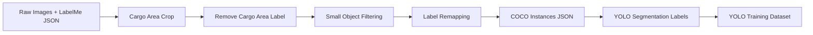

# Steel Scrap Segmentation Training Ver2

YOLO11 segmentation 기반 철스크랩 객체 segmentation 학습 방법과 실험 결과를 정리한 문서입니다.  
본 문서는 데이터 준비 과정, 학습 조건, 정량 결과, 정성 평가 관점, 그리고 최종 학습 전략을 결과 중심 README 형식으로 설명합니다.

## Summary

| Item | Value |
|---|---|
| Task | Instance Segmentation |
| Model | `yolo11s-seg.pt` |
| Epochs | `300` |
| Optimizer | `AdamW` |
| Initial LR | `0.001` |
| Image Size | `1024` |
| Batch | `-1` |
| Close Mosaic | `10` |
| Best Run | `train5` |
| Best Filtering | `16px` |
| Best mAP | `0.901` |

실험 결과, `imgsz=1024` 기준 작은 객체 제거 threshold를 높일수록 validation mAP가 상승했습니다. 현재 실험 범위에서는 `16px` 기준이 가장 높은 mAP를 보였습니다.

## Dataset

| Split | Images |
|---|---:|
| Train | 2096 |
| Val | 418 |

학습 데이터는 LabelMe polygon annotation과 이미지를 기반으로 구성합니다. 최종 YOLO 학습에는 `datasets/data.yaml`, `datasets/images`, `datasets/labels`가 사용됩니다.

```text
datasets/
  images/
    train/
    val/
  labels/
    train/
    val/
  annotations/
    instances_train.json
    instances_val.json
  classes.txt
  data.yaml
```

## Preprocessing Pipeline



### Pipeline Steps

| Step | Script | Purpose | Output |
|---:|---|---|---|
| 0 | `0_build_cargo_dataset.py` | `"73. Cargo Area"` polygon 기준 crop | `datasets/train_cropped`, `datasets/val_cropped` |
| 0 | `0_remove_cargo.py` | crop 이후 Cargo Area annotation 제거 | cropped LabelMe JSON |
| 1 | `1_remove_small_filter.py` | YOLO 1024 resize 기준 작은 polygon 제거 | `train_data_filtered`, `val_data_filtered`, `images/train`, `images/val` |
| 2 | `2_remap_labelme_exact.py` | 원본 상세 라벨을 19개 학습 라벨로 통합 | `train_remapped`, `val_remapped` |
| 3 | `3_annotations_to_instances.py` | LabelMe JSON을 COCO instance JSON으로 변환 | `instances_train.json`, `instances_val.json` |
| 4 | `4_labels_yolo.py` | COCO instance를 YOLO segmentation txt label로 변환 | `labels/train`, `labels/val`, `data.yaml` |

### Run Preprocessing

이미 crop된 데이터가 `datasets/train_cropped`, `datasets/val_cropped`에 준비되어 있으면 기본 실행을 사용합니다.

```bash
python run_data_preprocessing.py
```

Cargo Area annotation이 포함된 원본 데이터에서 crop부터 다시 수행해야 하면 다음 옵션을 사용합니다.

```bash
python run_data_preprocessing.py --run-build-cargo
```

## Label Remapping

원본 데이터는 세부 라벨 수가 많기 때문에 학습 안정성을 위해 19개 대표 클래스로 통합합니다.

```text
structure steel
rebar
mixed steel
panel
square pipe
trash
heavy iron
small pipe
vehicle
pipe
plastic
machine
mesh
LPG GAS cylinder
handler
beam
Fan
drum
Guillotine
```

라벨 재매핑의 목적은 유사한 물체를 하나의 학습 클래스로 묶어 class imbalance와 label sparsity를 줄이는 것입니다.

## Small Object Filtering

작은 객체 제거는 원본 이미지 픽셀 기준이 아니라, YOLO 입력 크기 `1024`로 resize된 이후의 크기를 기준으로 수행합니다.

```python
YOLO_IMGSZ = 1024
MIN_SIZE_AFTER_RESIZE = N
MIN_AREA_AFTER_RESIZE = N * N
```

예를 들어 `10px` 기준은 resize 후 bbox의 짧은 변이 `10px` 미만이거나 polygon 면적이 `100px²` 미만인 annotation을 제거합니다.

### Original Pixel Equivalent

`Npx` threshold는 원본 이미지에서 직접 `Npx`를 제거한다는 의미가 아닙니다. YOLO 학습 시 `imgsz=1024`로 resize된 뒤의 크기 기준입니다.

원본 이미지 기준 환산은 다음과 같이 계산할 수 있습니다.

```text
scale = 1024 / max(image_width, image_height)
original_side_threshold = N / scale
                        = N * max(image_width, image_height) / 1024
```

현재 작업 폴더에서 환산 계산에 사용한 `datasets/train_cropped`, `datasets/val_cropped` JSON 기준 평균 이미지 크기는 다음과 같습니다.

| Split | Images | Mean Width | Mean Height | Mean Long Side |
|---|---:|---:|---:|---:|
| Train | 1676 | 1695.98px | 1704.53px | 1877.76px |
| Val | 418 | 1698.10px | 1706.69px | 1878.26px |
| All | 2094 | 1696.40px | 1704.96px | 1877.86px |

따라서 전체 평균 긴 변 `1877.86px` 기준으로 환산하면 다음과 같습니다.

| Resize After Filtering | Original Side Equivalent | Original Area Equivalent |
|---:|---:|---:|
| 10px | 18.34px | 336.3px² |
| 12px | 22.01px | 484.3px² |
| 13px | 23.84px | 568.3px² |
| 14px | 25.67px | 659.1px² |
| 16px | 29.34px | 860.9px² |

즉 `16px` 실험은 원본 평균 이미지 기준으로 bbox의 짧은 변이 약 `29.34px` 미만이거나 polygon 면적이 약 `860.9px²` 미만인 객체를 제거한 것과 비슷합니다. 실제 기준은 이미지별 긴 변에 따라 달라지므로, 위 값은 평균 크기 기준의 환산값입니다. 학습 데이터셋을 다시 구성하면 평균 이미지 크기가 달라질 수 있으므로 이 환산값도 함께 다시 계산하는 것이 좋습니다.

이 필터는 다음 목적을 가집니다.

- 너무 작은 polygon annotation으로 인한 학습 노이즈 감소
- resize 후 mask가 거의 사라지는 객체 제거
- segmentation loss가 안정적으로 작동할 수 있는 객체 중심 학습
- validation mAP 관점에서 더 안정적인 모델 선택

단, pipe, rebar, wire처럼 길고 얇은 객체가 중요한 경우 threshold가 너무 크면 작은 객체 recall이 낮아질 수 있습니다.

## Training Setup

모든 실험은 동일한 학습 조건에서 작은 객체 제거 기준만 바꿔 비교했습니다.

```bash
yolo task=segment mode=train \
  model=yolo11s-seg.pt \
  data=datasets/data.yaml \
  epochs=300 \
  optimizer=AdamW \
  lr0=0.001 \
  imgsz=1024 \
  batch=-1 \
  close_mosaic=10 \
  verbose=False
```

## Quantitative Results

### Experiment Table

| Date | Crop | Label Remap | Small Object Filter | Run | mAP | Training Time | Start | End Check |
|---|---:|---:|---:|---|---:|---:|---|---|
| 2026.06.11 | O | O | 10px | train10 | 0.787 | 12.876 h | 26.06.11 10:00 | 26.06.12 10:00 |
| 2026.06.10 | O | O | 12px | train8 | 0.824 | 6.046 h | 25.06.10 11:00 | 26.06.10 17:00 |
| 2026.06.10 | O | O | 13px | train7 | 0.850 | 5.810 h | 26.06.09 17:00 | 26.06.10 10:00 |
| 2026.06.09 | O | O | 14px | train6 | 0.869 | 6.873 h | 26.06.09 10:00 | 26.06.09 16:00 |
| 2026.06.08 | O | O | 16px | train5 | 0.901 | 7.858 h | 26.06.08 13:00 | 26.06.08 20:00 |

### mAP by Small Object Filter

| Small Object Filter | Original Side Equivalent | Original Area Equivalent | mAP |
|---:|---:|---:|---:|
| 10px | 18.34px | 336.3px² | 0.787 |
| 12px | 22.01px | 484.3px² | 0.824 |
| 13px | 23.84px | 568.3px² | 0.850 |
| 14px | 25.67px | 659.1px² | 0.869 |
| 16px | 29.34px | 860.9px² | 0.901 |

```text
10px  | 0.787
12px  | 0.824
13px  | 0.850
14px  | 0.869
16px  | 0.901
```

## Quantitative Interpretation

현재 실험에서는 작은 객체 제거 기준을 높일수록 validation mAP가 상승했습니다.

이는 현재 annotation에서 작은 polygon이 학습 노이즈로 작용했을 가능성을 보여줍니다. 작은 polygon은 `imgsz=1024`로 resize된 뒤 mask가 매우 작아져 polygon 좌표 오차, labeling noise, class ambiguity의 영향을 크게 받습니다. 따라서 너무 작은 객체를 제거하면 모델이 더 명확하고 안정적인 segmentation target에 집중하게 됩니다.

현재 결과만 기준으로 하면 `16px` 필터가 가장 좋은 선택입니다.

## Qualitative Review

정량 결과는 `16px` 모델이 가장 우수하지만, 실제 적용 가능성을 판단하려면 정성 평가가 필요합니다.

### Recommended Visual Checks

| Check | Purpose |
|---|---|
| Ground Truth vs Prediction | mask 위치와 형태가 실제 객체를 잘 따라가는지 확인 |
| 14px vs 16px Comparison | 작은 객체 누락이 성능 향상과 trade-off인지 확인 |
| Thin Object Cases | pipe, small pipe, rebar, wire 계열 객체 recall 확인 |
| Dense Scrap Cases | 객체가 많이 겹친 이미지에서 mask 분리 성능 확인 |
| Failure Cases | 누락, 과분할, 과병합, 잘못된 클래스 예측 사례 확인 |

### Qualitative Result Template

아래 표는 정성 결과 이미지를 추가할 때 사용할 수 있는 형식입니다.

| Case | Ground Truth | Prediction | Note |
|---|---|---|---|
| Good case | `docs/assets/gt/sample_01.jpg` | `docs/assets/pred/sample_01.jpg` | 주요 객체 mask가 안정적으로 검출됨 |
| Small object miss | `docs/assets/gt/sample_02.jpg` | `docs/assets/pred/sample_02.jpg` | 작은 pipe/rebar 일부 누락 |
| Dense objects | `docs/assets/gt/sample_03.jpg` | `docs/assets/pred/sample_03.jpg` | 인접 객체 mask 분리 확인 필요 |

### Threshold Comparison Template

동일 validation 이미지에 대해 작은 객체 제거 기준별 예측 결과를 비교하면 threshold 선택 근거가 더 명확해집니다.

| Image | 10px | 12px | 14px | 16px |
|---|---|---|---|---|
| sample_01 | prediction image | prediction image | prediction image | prediction image |
| sample_02 | prediction image | prediction image | prediction image | prediction image |

## Discussion

### Why Higher Filtering Improved mAP

`16px` 기준이 가장 높은 mAP를 보인 이유는 다음과 같이 해석할 수 있습니다.

- 작은 polygon annotation의 상대적 좌표 오차 감소
- resize 후 거의 사라지는 mask 제거
- class ambiguity가 큰 작은 객체 제거
- 학습 대상이 큰 객체 중심으로 정리됨
- segmentation loss가 더 안정적인 target에 집중됨

### Trade-off

| Threshold | Strength | Risk |
|---:|---|---|
| 10px | 작은 객체를 더 많이 보존 | annotation noise와 작은 mask로 인해 mAP 저하 가능 |
| 12px | 작은 객체 보존과 노이즈 제거 사이의 중간 기준 | 여전히 작은 객체 noise가 남을 수 있음 |
| 13px | 점진적 정제 기준 | 모델 선택 근거가 애매할 수 있음 |
| 14px | mAP와 작은 객체 보존의 균형 후보 | 16px보다 전체 mAP는 낮음 |
| 16px | 가장 높은 mAP, 안정적인 학습 | 작은 객체 recall 저하 가능 |

## Recommended Training Strategy

현재 실험 결과 기준 권장 전략은 다음과 같습니다.

1. crop과 라벨 재매핑은 유지한다.
2. 기본 모델은 `16px` small-object filtering 결과를 사용한다.
3. 최종 모델 선택 전 `14px` 모델과 `16px` 모델을 정성 비교한다.
4. 작은 pipe, rebar, wire가 중요한 운영 조건이면 `14px` 모델을 후보로 유지한다.
5. 큰 객체 중심의 안정적인 segmentation이 목적이면 `16px` 모델을 우선 선택한다.

## Artifacts

| Artifact | Path |
|---|---|
| Dataset config | `datasets/data.yaml` |
| Class list | `datasets/classes.txt` |
| Train images | `datasets/images/train` |
| Val images | `datasets/images/val` |
| Train labels | `datasets/labels/train` |
| Val labels | `datasets/labels/val` |
| COCO train annotation | `datasets/annotations/instances_train.json` |
| COCO val annotation | `datasets/annotations/instances_val.json` |
| Training runs | `runs/segment/` |

## Conclusion

현재 실험에서는 crop, label remapping, small-object filtering을 적용한 데이터 준비 방식이 유효했고, 작은 객체 제거 기준 중에서는 `16px`가 가장 높은 mAP를 보였습니다.

따라서 현재 기준의 best model은 `train5`, `16px`, `mAP 0.901`로 정리할 수 있습니다. 다만 작은 객체 검출이 중요한 적용 환경에서는 `14px`와 `16px`의 정성 비교를 통해 최종 모델을 선택하는 것이 좋습니다.
